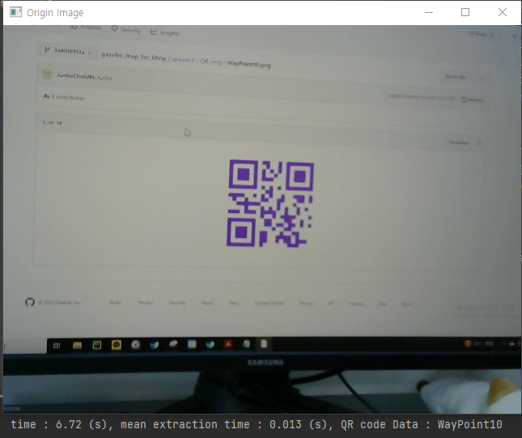

# BarcodeReader
It recognizes the barcode with the webcam and provides internal information to the user.

# Required Python Package
- OpenCV
- Numpy

# Result

### Image

: time, operation time, data

# experiment
- It takes 0.014 seconds between one extraction on average

